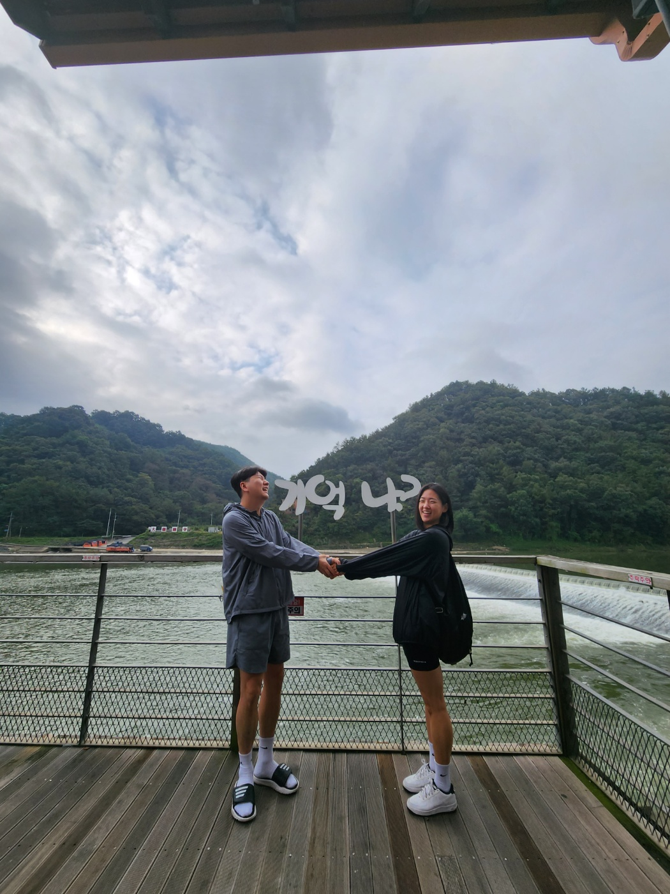

# 오늘 처음 블로그를 만들었어요.

안녕하세요 이석기입니다.
앞으로 열심히 해보겠습니다.

반영되는지 확인하려고 합니다.

```python
if response.lower().startswith("y"):
    print("Nice :)")
    sys.exit()

elif response.lower().startswith("n"):
    response2 = input("Is it because I am a robot? → ")

else:
    print("You may have made an input error. Please restart and try again.")
    sys.exit()
if response2.lower().startswith("y"):
    print("Aw :(")

elif response2.lower().startswith("n"):
    response3 = input("Then why? → ")
    time.sleep(1)
    print("Oh.")

else:
    print("You may have made an input error. Please restart and try again.")
    sys.exit()
```

